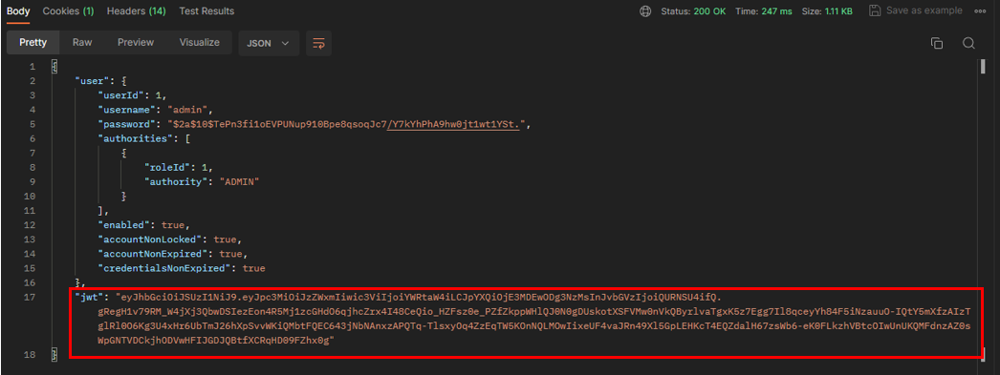
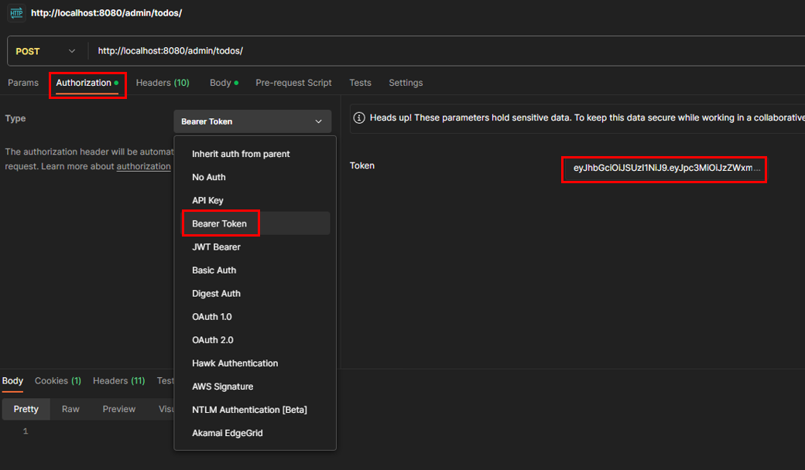
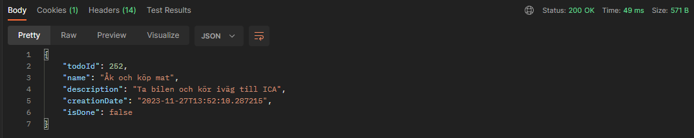
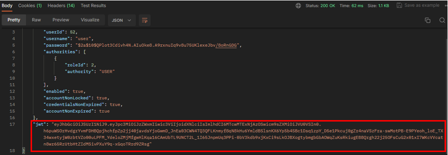
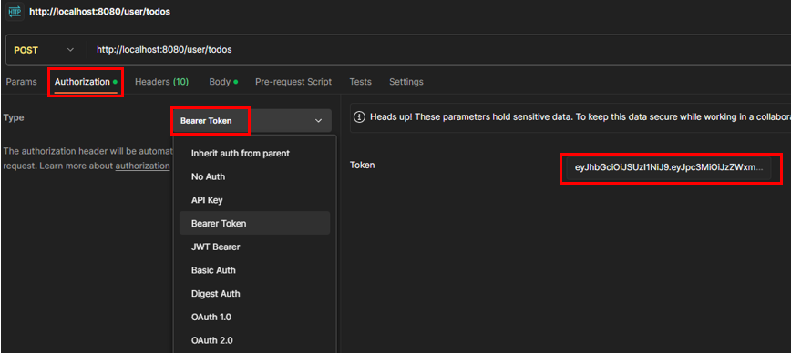
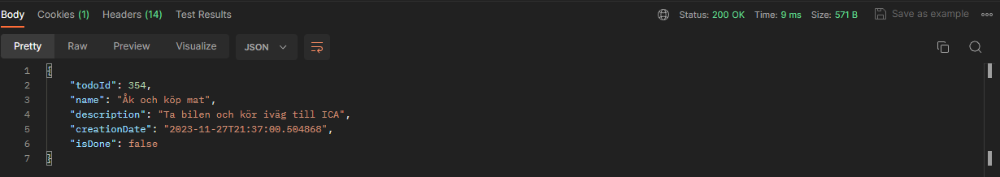

# Todo-applikation
Spring application with secure registration and login where the user can store their todos.

## Description
The Todo application is a RESTful API service built with Java and Spring Boot. It provides a secure platform for users to manage their todos. 
The application features secure user registration and login functionality, and allows users to create and read their todos. 
The application uses MySQL for data storage and Postman for testing the API endpoints. 
It also uses Spring Security for authentication and authorization, ensuring that only authenticated users can access their respective todos. 
The application is designed with a focus on simplicity and ease of use, making it a great tool for personal task management. 

**Regular user can:** Create and read Todos.

**Admin users can:** Create, read, update and delete Todos.

The application will automatically create an admin account if it does not already exist. The username is *admin* and the password is *password*.

## Installation

Before you can start this project, you must follow these steps:

- Download and install Postman on your local machine
- Download and install MySQL and MySQL Workbench on your local machine.
- Clone this repository to your local machine.


## Usage

### 1. Set up the MySQL database:
- Open MySQL Workbench.
- Connect to your MySQL server.
- Create a new schema for the application. You can do this by clicking on the "Create a new schema in the connected server" button, entering a name for the schema, and clicking "Apply".
- Ensure that the *schema name* *username*, and *password* in the application.properties file match your MySQL setup.

### 2. Start the application:
- Open your IDE and run the TodoApplikationApplication class to start the application.

### 3. Test the application with Postman:
 **<u>As an admin:</u>**

- Open Postman
- Create a new request by clicking on the "New" button and selecting "Request".
- Choose POST-request and enter the URL http://localhost:8080/auth/login. 
Click on the "Body" tab, select "raw", and choose "JSON" from the dropdown menu. 
- For admin login (full CRUD), enter:

```
{
  "username": "admin",
  "password": "password"
}
```

- Click on the "Send" button. A JSON-response will be displayed in the section below.

- Copy the JWT that is displayed in the response:


 
- Enter the URL for the todo-endpoint you want to test. The URL for all admin-functionality is: http://localhost:8080/admin/todos/.

- Select the HTTP method for the request (GET, POST, PUT, or DELETE) depending on the operation you want to perform.

- Click "Authorization" --> "Bearer token" and paste the JWT in the Token box:



- If you're creating a new Todo (POST request) or updating an existing one (PUT request), you'll need to provide the Todo details in the request body. 
Click on the "Body" tab, select "raw", and choose "JSON" from the dropdown menu. Then enter the Todo details in JSON format, for example:

```
{
"name": "Åk och köp mat",
"description": "Ta bilen och kör iväg till ICA",
"isDone": "false"
}
```

- Click "Send" to send the request. The response will be displayed in the section below.




**<u>As a regular user:</u>**

- To log in as a regular user, you must first register a user using this URL: http://localhost:8080/auth/register.
- Do this by creating a new POST-request, click on the "Body" tab, select "raw", and choose "JSON" from the dropdown menu.
  Then enter your chosen username and password, for example:

```
{
  "username": "user",
  "password": "password"
}
```

- Then choose POST-request and enter the URL http://localhost:8080/auth/login.
- Click on the "Body" tab, select "raw", and choose "JSON" from the dropdown menu.
- Enter the username and password:

```
{
"username": "user",
"password": "password"
}
```

- Click on the "Send" button. A JSON-response will be displayed in the section below.

- Copy the JWT that is displayed in the response:



- Enter the URL for the todo-endpoint you want to test. The URL for all user-functionality is: http://localhost:8080/user/todos/.

- Select the HTTP method for the request (GET or POST) depending on the operation you want to perform.

- Click "Authorization" --> "Bearer token" and paste the JWT in the Token box:



- If you're creating a new Todo (POST request), you'll need to provide the Todo details in the request body.
  Click on the "Body" tab, select "raw", and choose "JSON" from the dropdown menu. Then enter the Todo details in JSON format, for example:

```
{
"name": "Åk och köp mat",
"description": "Ta bilen och kör iväg till ICA",
"isDone": "false"
}
```

- Click "Send" to send the request. The response will be displayed in the section below.




### 4. View the data in MySQL Workbench:
- In MySQL Workbench, open the schema you created for the application.
- Click on the "Tables" section to expand it.
- Right-click on the todos table and select "Select Rows - Limit 1000" to view the data in the table.


## Credits

I received help and inspiration from the following sources:

* [Marcus Henriksson](https://github.com/MarcusRestoryAi)
* [GitHub Copilot Chat](https://docs.github.com/en/copilot/github-copilot-chat/using-github-copilot-chat-in-your-ide)

## Dependencies

* [spring-boot-starter-data-jpa](https://mvnrepository.com/artifact/org.springframework.boot/spring-boot-starter-data-jpa)
* [spring-boot-starter-web](https://mvnrepository.com/artifact/org.springframework.boot/spring-boot-starter-web)
* [spring-boot-devtools](https://mvnrepository.com/artifact/org.springframework.boot/spring-boot-devtools)
* [mysql-connector-j](https://mvnrepository.com/artifact/com.mysql/mysql-connector-j/8.2.0)
* [spring-boot-starter-test](https://mvnrepository.com/artifact/org.springframework.boot/spring-boot-starter-test)
* [spring-boot-starter-security](https://mvnrepository.com/artifact/org.springframework.boot/spring-boot-starter-security)
* [spring-boot-starter-oauth2-resource-server](https://mvnrepository.com/artifact/org.springframework.security.oauth/spring-security-oauth2)


## License

[MIT License](https://choosealicense.com/licenses/mit/)

---
